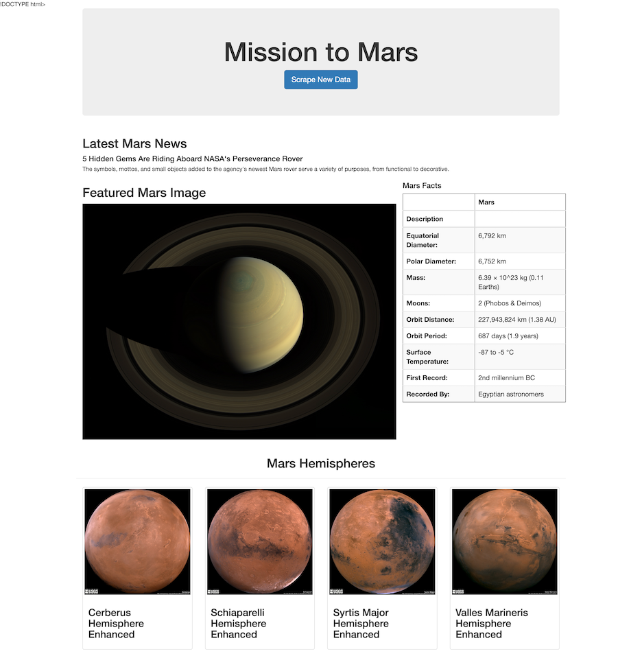

# Mission to Mars Web Scraping

  

This project developed a website that scrapes the latest news and data on Mars from the following sources: NASA Mars News Site, Jet Propulsion Laboratory, Space Facts, and USGS Astrogeology.

Python Requests/Splinter, BeautifulSoup, and Pandas, and MongoDB were used to scrape and store the required data, and Python Flask was used to automate those processes. HTML and Bootstrap CSS were used to generate and format the completed webpage presenting the scraped data.

---

## Process ##

### A. Scraping

* Created a Jupyter Notebook file called `mission_to_mars.ipynb` and used this to complete all of the scraping and analysis.
* Used Splinter to navigate the sites and BeautifulSoup to find and parse out the necessary data.

    ### 1. NASA Mars News

    * Scraped the [NASA Mars News Site](https://mars.nasa.gov/news/) and collect the latest News Title and Paragraph Text. 
    * Assigned the text to variables that can be referenced later.

    ### 2. JPL Mars Space Images - Featured Image

    * Visited the url for [Jet Propulsion Laboratory](https://www.jpl.nasa.gov/spaceimages/?search=&category=Mars) Featured Space Image.
    * Used splinter to navigate the site and find the image url for full size `.jpg` image of the current Featured Mars Image and assigned the url string to a variable called `featured_image_url`.
    * Saved a complete url string for this image.

    ### 3. Mars Facts

    * Visited the [Mars Facts](https://space-facts.com/mars/) webpage and used Pandas to scrape the table containing facts about the planet including Diameter, Mass, etc.
    * Used Pandas to convert the data to a HTML table string.

    ### 4. Mars Hemispheres

    * Visited the [USGS Astrogeology](https://astrogeology.usgs.gov/search/results?q=hemisphere+enhanced&k1=target&v1=Mars) site to obtain high resolution images for each of Mars's hemispheres.
    * Found the url to the full resolution image by clicking each of the links to the hemispheres.
    * Saved both the image url string for the full resolution hemisphere image, and the hemisphere title containing the hemisphere name. 
    * Used a Python dictionary to store the data using the keys `img_url` and `title`.
    * Appended the dictionary with the image url string and the hemisphere title to a list containing one dictionary for each hemisphere.

### B. MongoDB and Flask Application

* Used MongoDB with Flask templating to create a new HTML page that displays all of the information that was scraped from the URLs above.
* Converted the Jupyter notebook into a Python script called `scrape_mars.py` with a function called `scrape` that runs all of the scraping code from above and returns one Python dictionary containing all of the scraped data.
* Created a route called `/scrape` that will import the `scrape_mars.py` script and call the `scrape` function.
* Stored the returned value in Mongo as a Python dictionary.
* Created a root route `/` that queried the Mongo database and passed the Mars data into an HTML template to display the data.
* Created a template HTML file called `index.html` takes the Mars data dictionary and displayed all of the data in the appropriate HTML elements.

---

## Completed Website ##

  

---

## Data Sources ##
* [NASA Mars News Site](https://mars.nasa.gov/news/)
* [Jet Propulsion Laboratory](https://www.jpl.nasa.gov/spaceimages/?search=&category=Mars)
* [Mars Facts](https://space-facts.com/mars/)
* [USGS Astrogeology](https://astrogeology.usgs.gov/search/results?q=hemisphere+enhanced&k1=target&v1=Mars)

---

## Technologies Used ##
* Python - Pandas, Splinter/Requests, BeautifulSoup, Flask, PyMongo, Datetime
* Jupyter Notebook
* PyCharm - Python IDE
* MongoDB
* HTML, CSS
* Bootstrap

---

## Author ##
Kiran Rangaraj - LinkedIn: [@Kiran Rangaraj](https://www.linkedin.com/in/kiranrangaraj/)
